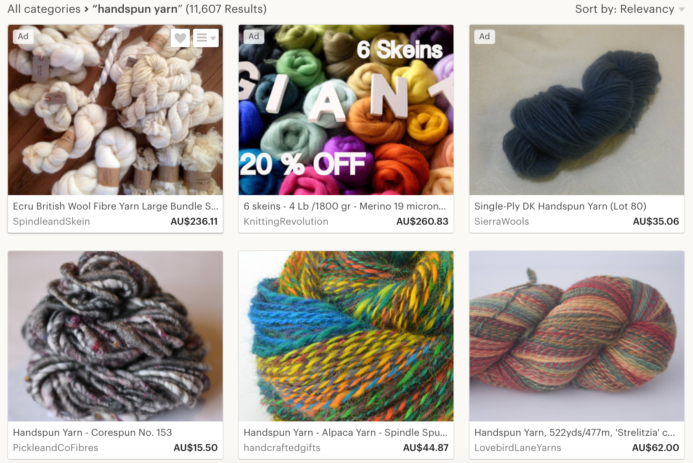
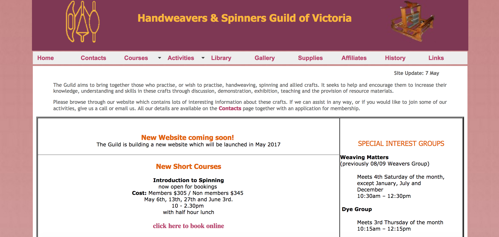
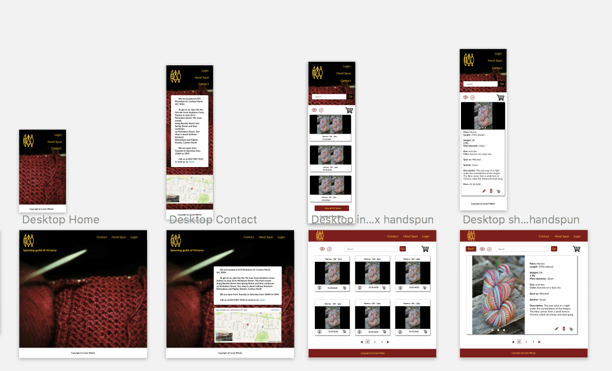
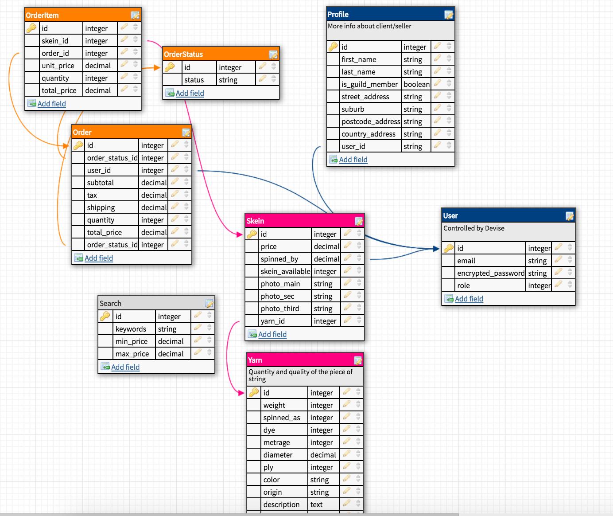

# APP DESCRIPTION
1. This is a 2 sided market place allowing the sell and purchase of hand spun yarn. Hand spinners can post their finished products (known as skein) online and keen knitters or weavers can purchase these skeins. They then pick up their purchase from the guild in Melbourne, where the skeins are stored. Alternatively arrangements can be made for shipping the goods to the client.
2. There are essentially 3 groups of users: the admin staff that looks after registration and distributing/shipping products int the shop, the spinners who craft their products and the users, that is the public who want to browse and/or purchase some hand spun yarn.
 
## MY TARGET MARKET
* Knitters / Weavers
* Spinners who have too much yarn on hand
* Knitters / Weavers / Public who want to destash their handspun yarn
* Farmers who want to promote their rare / heritage breed
* Crafters who want to have access to pure and natural products
* Environmentally conscious folks who want to complete a sheep to shawl project
* Environmentally conscious people who want to support their local produce / farmers.

## USER STORIES
* As a spinner, I want to be able to sell excess skeins so that I don't accumulate yarn that I probably won't use at home.
* As a knitter, i want to get hand spun yarn so that I can knit unique garments and accessories.
* As a member of the spinning Guild of Victoria I want to sell the skeins that my members have spun and put on display so that they are being used purposely (and not just gathering dust).
* As a weaver, I want to include special hand spun yarn to create unique weaving projects.
* As a knitter, I want to be able to request a spinner to spin me a certain quantity and type of fibre, to complete a specific knitting project (i.e. jumper)
* As a farmer I want to see the various types of yarn my sheep produce to know the quality I can achieve.
* As a farmer I want to know whether fibre users (spinners and knitters) like my products so that I can raise the right stock or breed line to meet the demand.
* As a knitter I want to see many various hand spun skeins I can choose from to spark my creativity.
* As an environmentally conscious knitter I want to select fibres that haven't been dyed to limit the use of chemicals

# INSPIRATION
I have been many times to the hand spun and weaving guild of Victoria (and Tasmania) and have noticed that there are over a 100 skeins sitting there, that are stunningly beautiful but not advertised as they should. Each skein is sold roughly between AUD30 and AUD60. So that represents some money!

# COMPETITORS
The main competition would be **Etsy**.
- In my app the user would be able to dynamically place next to each other photos of the products they would purchase. This is particularly useful for **color-work** (i.e knitting fair isle / striped sweaters or weaving).
- Also there is the option to pick up from the Melbourne store to **save on shipping cost**.

# DESIGN
## Theme

There is a current website that the guild uses. It's http://handweaversandspinnersguildofvictoria.org.au/index.htm
They have a color theme and a logo which I need to respect.
Hence the color scheme remains in the warm **burgundy** tones and the icon in shiny **gold**.
Given that the target audience is typically **mature aged**, I designed a site that easy to navigate in.

Ideally the two sided market place will reside within the hand weaver and spinning guild of victoria.

## Wireframes

I've worked with a mobile first approach. Keeping the theme as described above.

## My Trello Board

All details and agile execution are documented on my trello board:
https://trello.com/b/r4Fbi5yX/spinning-yarn-round-round

## My Database

I've used dbdesigner.net to jot down my relational tables and the schema.
http://dbdesigner.net/designer/schema/87230

# TECHNICAL CHALLENGES

1. Deciding what constitue a MVP (Minimum Viable Product). It's easy to spend longer than allocated on a particular feature. 
2. First time using Amazon Services (S3 bucket)
3. Working with secret keys (amazon and stripe services) and ensuring that they remain secret in a .env file.
4. Deployed to Heroku and had to seed the database to be able to 'start' the app as intended.
5. Implementing a cart system.
6. Authentication and authorisation are critical in this application. I've learned to use devise and petergate to achieve the desired outcome.
7. Implemented search function.

## gems used
* devise
* bootstrap
* font-awesome-rails
* carrierwave
* mini_magick
* carrierwave-aws
* dotenv-rails
* petergate
* stripe
* rails-assets-tether
* kaminari
* ruby "2.4.0"

# FUTURE WORK / IMPROVEMENT
* Optimize Heroku as some pages don't display like on my localhost
* Work on desktop layout
* Incorporate 2 sided market place into the main website
* Include a mail exchange system so that purchasers are notified of their purchases and potential
* Include a comments option to ask questions about the products
* Rate spinners / yarn 
* Improve cart system to be able to update/delete elements
* User to be able to place photos together to check for color matching